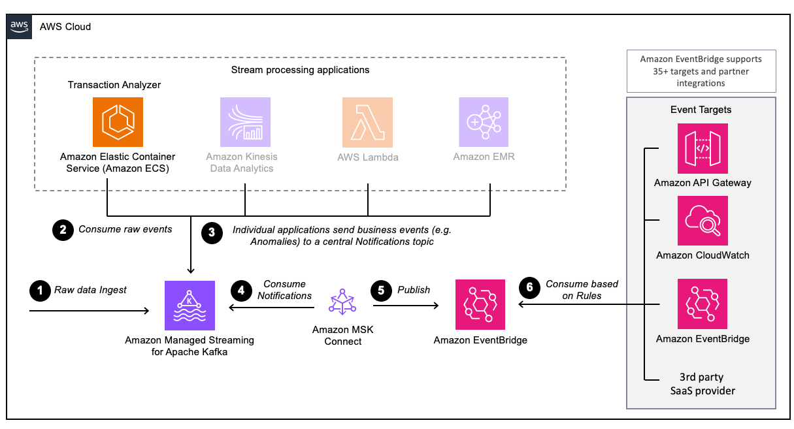

# Kafka Connector for Amazon EventBridge Deployment on AWS

This CDK stack is sample deployment for the Kafka Connector for Amazon EventBridge. 

> **Warning**  
> This sample is not meant to be deployed to production environments!

## Overview

This sample deploys several components in your AWS account:

- Amazon MSK Serverless Cluster
- Amazon S3 Bucket
- IAM Roles & Security Groups
- VPC & related components
- Custom Amazon EventBridge Bus
- Amazon ECS cluster with 2 Services (Data Producer & Transaction Analyzer)
- (Optional) Amazon MSK Connector

To learn more about those components please read the blog on the [AWS Big Data Blog](https://aws.amazon.com).



## Deployment

There are 2 deployment options for the CDK stack. Please choose the FULL method if you don't want to set up the connector
manually as described in the blog linked above. 

To deploy everything mentioned above, including the Connector itself please run the following command in this directory:
```shell
cdk deploy --context deploymentMode=FULL
```

To deploy only the Prerequisites and later deploy the connector manually. Please run the following command in this directory:

```shell
cdk deploy --context deploymentMode=PREREQ
```

The Instructions to manually set up the connector can be found in the corresponding [Blog Post](https://aws.amazon.com).

## Cleanup

To delete all resources run the following command in this directory:

```
cdk destroy
```